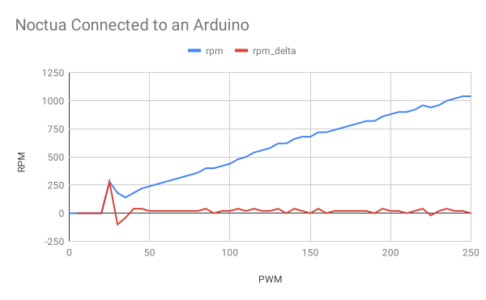
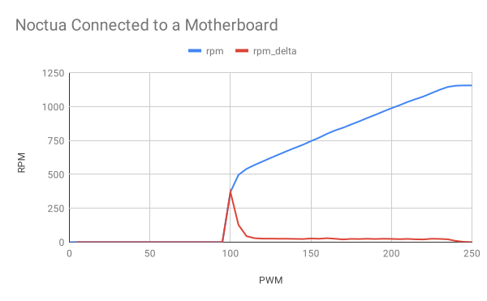
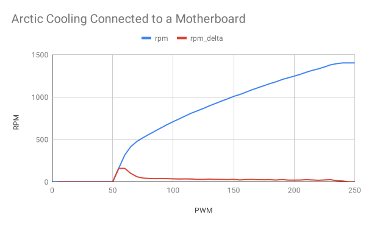

Welcome to afancontrol's documentation!
=======================================

:Docs: https://afancontrol.readthedocs.io/
:Source Code: https://github.com/KostyaEsmukov/afancontrol
:Issue Tracker: https://github.com/KostyaEsmukov/afancontrol/issues
:PyPI: https://pypi.org/project/afancontrol/

Introduction
~~~~~~~~~~~~

`afancontrol` stands for "Advanced fancontrol". Think of it as
`fancontrol <https://github.com/lm-sensors/lm-sensors/blob/master/prog/pwm/fancontrol>`_
with more advanced configuration abilities.

`afancontrol` measures temperature from the sensors, computes the required
airflow and sets the PWM fan speeds accordingly.

Key features:

- Configurable temperature sources (currently supported ones are `lm-sensors`
  temps, `hddtemp` and arbitrary shell commands);
- Configurable PWM fan implementations (currently supported ones are
  `lm-sensors` PWM fans, `freeipmi` (readonly) and
  `a custom Arduino-based solution <index.html#pwm-fans-via-arduino>`_);
- Configurable mappings between the temp sensors and the fans (e.g. fans
  would be more sensitive to the closely located sensors than to
  the farther-located ones);
- Temperature filters to smoothen fan reactions;
- Prometheus-compatible metrics exporter;
- Custom shell commands might be run when temperature reaches configured
  thresholds;
- OS-agnostic (`afancontrol` is written in Python3 and might be run on any OS
  which can run Python).

`afancontrol` might be helpful in the following scenarios:

- You have built a custom PC case with many different heat-generating parts
  (like HDDs and GPUs) which you want to keep as quiet as possible, yet
  being kept cool enough when required (at the cost of increased fan noise);
- You need to control more 4-pin PWM fans than there're connectors
  available on your motherboard (with an Arduino board
  connected via USB);
- You simply want to control a PWM fan with HDD temperatures.

How it works
~~~~~~~~~~~~

`afancontrol` should be run as a background service. Every 5 seconds
(configurable) a single `tick` is performed. During a `tick`
the temperatures are gathered and the required fan speeds are calculated
and set to the fans. Upon receiving a SIGTERM signal the program would
exit and the fans would be restored to the maximum speeds.

PWM Fan Line
------------

Each PWM fan has a PWM value associated with it which sets the speed of
the fan, where ``0`` PWM means that the fan is stopped, and ``255`` PWM
means that the fan is running at full speed.

The correlation between the PWM value and the speed is usually not linear.
When computing the PWM value from a temperature, `afancontrol` uses
a specified range of the PWM values where the correlation between speed
and PWM is close to linear (these are the ``pwm_line_start`` and
``pwm_line_end`` config params).

The bundled ``afancontrol fantest`` interactive command helps to determine
that range, which is specific to a pair of a PWM fan and a motherboard.
Here are some examples to give you an idea of the difference:

1) A Noctua fan connected to an Arduino board. The correct settings in
this case would be:

- ``pwm_line_start = 40``
- ``pwm_line_end = 245``

2) The same fan connected to a motherboard. The correct settings in this
case would be:

- ``pwm_line_start = 110``
- ``pwm_line_end = 235``

3) Another fan connected to the same motherboard. The correct settings
in this case would be:

- ``pwm_line_start = 70``
- ``pwm_line_end = 235``

Mappings
--------

Consider the following almost typical PC case as an example:

Assuming that `Intake Fans` share the same PWM wire and are connected to
a `Fan 2` connector on the motherboard, and `Outtake Fans` share the PWM
wire of a `Fan 3` motherboard connector, the fans config might look
like the following:

::

    [fan: intake]
    type = linux
    pwm = /sys/class/hwmon/hwmon0/device/pwm2
    fan_input = /sys/class/hwmon/hwmon0/device/fan2_input
    pwm_line_start = 100
    pwm_line_end = 240
    never_stop = no

    [fan: outtake]
    type = linux
    pwm = /sys/class/hwmon/hwmon0/device/pwm3
    fan_input = /sys/class/hwmon/hwmon0/device/fan3_input
    pwm_line_start = 100
    pwm_line_end = 240
    never_stop = yes

The temperature sensors might look like this:

::

    [temp: cpu]
    type = file
    path = /sys/class/hwmon/hwmon1/temp1_input
    min = 50
    max = 65
    panic = 80

    [temp: mobo]
    type = file
    path = /sys/class/hwmon/hwmon0/temp1_input
    min = 55
    max = 65
    panic = 80

    [temp: gpu]
    type = exec
    command = nvidia-smi --query-gpu=temperature.gpu --format=csv,noheader,nounits -i 0
    min = 55
    max = 65
    panic = 85

    [temp: hdds]
    type = hdd
    path = /dev/sd?
    min = 38
    max = 45
    panic = 50

Now we need to create the mappings between the temps and the fans.
The simplest mapping would be:

::

    [mapping: all]
    fans = intake, outtake
    temps = cpu, mobo, gpu, hdds

The more fine-grained mappings configuration:

::

    [mapping: hdd]
    fans = intake, outtake * 0.6
    temps = hdds

    [mapping: mobo]
    fans = intake, outtake
    temps = cpu, mobo, gpu

Fan speeds are calculated as following (this is a simplified
version for the matter of brevity):

- For each temperature compute a desired `temperature speed` as
  ``(current_temperature - min) / (max - min)``.
- For each mapping compute a desired `mapping speed` as a maximum across
  all of the mapping's `temperature speeds`.
- For each fan compute a desired `fan speed` as a maximum across
  all of the `mapping speeds`, multiplied by the fan modifier of that
  mapping.
- For each fan apply a PWM value computed roughly
  as ``max(pwm_line_start, fan_speed * pwm_line_end)``.

If at least one fan reports a zero RPM when non-zero PWM is set (i.e.
the fan has jammed) or at least one temperature sensor reaches its `panic`
value, the `panic` mode is activated, which would cause all fans to run
at full speed until the issue is resolved.

Installation
~~~~~~~~~~~~

Debian package
--------------

There's a Dockerfile which can be used to build a Debian `.deb` package:

::

    # Build the .deb from the latest PyPI release:
    git clone https://github.com/KostyaEsmukov/afancontrol.git
    cd afancontrol
    make deb-from-pypi

    # Install the package:
    sudo apt install ./dist/debian/*.deb

Perhaps one day the package might get published to the Debian repos,
so a simple ``apt install afancontrol`` would work. But for now, given
that the package is not popular enough yet, I believe it doesn't worth
the hassle.

To upgrade, the similar steps should be performed on an up to date
`master` branch.

From PyPI
---------

`afancontrol` might be installed with `pip` like a typical Python package,
however, some extra steps are required to get the service running.

Note that this section assumes that systemd is used for managing system
processes. If this is not the case, skip all the commands related to systemd
and make sure to create a similar service for your init system.

::

    # Install the package:
    pip install afancontrol
    # Or, if Arduino or Prometheus support are required:
    pip install 'afancontrol[arduino,metrics]'

    # To use the motherboard-based sensors and PWM fans on Linux,
    # install lm-sensors:
    apt install lm-sensors
    # To use hddtemp for measuring HDD/SSD temperatures, install it:
    apt install hddtemp

The stock config and a systemd service files must be copied
manually:

::

    PYPREFIX=`python3 -c 'import sys; print(sys.prefix)'`
    # Usually PYPREFIX equals to `/usr/local`.

    sudo mkdir -p /etc/afancontrol/
    cp "${PYPREFIX}"/etc/afancontrol/afancontrol.conf /etc/afancontrol/
    cp "${PYPREFIX}"/etc/systemd/system/afancontrol.service /etc/systemd/system/

.. note::
    Do not edit the files under ``$PYPREFIX``! The ``pip`` command might
    overwrite these files without asking, so your changes would be lost.

To upgrade, ``pip install --upgrade afancontrol`` and
``systemctl restart afancontrol`` should be enough.

Getting Started
~~~~~~~~~~~~~~~

The bundled `configuration file`_ is generously annotated, so you could just
refer to it.

.. _configuration file: https://github.com/KostyaEsmukov/afancontrol/blob/master/pkg/afancontrol.conf

Generally speaking, the following steps are required (assuming that
the package is already installed):

- `Prepare an Arduino board <index.html#pwm-fans-via-arduino>`_, if
  extra PWM fan connectors are needed;
- Prepare and connect the PWM fans and temperature sensors;
- `Set up lm-sensors <index.html#lm-sensors>`_, if you want to use
  sensors or fans connected to a motherboard on Linux;
- Edit the configuration file;
- Start the daemon and enable autostart on system boot:

::

    sudo systemctl start afancontrol.service
    sudo systemctl enable afancontrol.service

PWM fans via Arduino
--------------------

An Arduino board might be used to control some PWM fans.

Here is a `firmware`_ and schematics for Arduino Micro:

.. _firmware: https://github.com/KostyaEsmukov/afancontrol/blob/master/arduino/micro.ino

.. image:: ./_static/micro_schematics.svg
   :target: ./_static/micro_schematics.svg

The given firmware can be flashed as-is on a Genuine Arduino Micro
without any tweaks. It is important to use Micro, because the firmware
was designed specifically for it. For other boards you might need to change
the pins in the firmware. Refer to its code for the hints on the places
which should be modified.

Once the board is flashed and connected, you may start using its pins
in `afancontrol` to control the PWM fans connected to the board.

lm-sensors
----------

`lm-sensors` is a Linux package which provides an ability to access and
control the temperature and PWM fan sensors attached to a motherboard
in userspace.

Run the following command to make `lm-sensors` detect the available
sensors hardware:

::

    sudo sensors-detect

Once configured, use the ``sensors`` command to get the current measurements.

Then you'd have to manually map the sensors with their actual physical location.

For example:

::

    $ sensors
    it8728-isa-0228
    Adapter: ISA adapter
    in0:          +0.92 V  (min =  +0.00 V, max =  +3.06 V)
    in1:          +1.46 V  (min =  +0.00 V, max =  +3.06 V)
    in2:          +2.03 V  (min =  +0.00 V, max =  +3.06 V)
    in3:          +2.04 V  (min =  +0.00 V, max =  +3.06 V)
    in4:          +2.03 V  (min =  +0.00 V, max =  +3.06 V)
    in5:          +2.22 V  (min =  +0.00 V, max =  +3.06 V)
    in6:          +2.22 V  (min =  +0.00 V, max =  +3.06 V)
    3VSB:         +3.34 V  (min =  +0.00 V, max =  +6.12 V)
    Vbat:         +3.31 V
    fan1:         571 RPM  (min =    0 RPM)
    fan2:        1268 RPM  (min =    0 RPM)
    fan3:           0 RPM  (min =    0 RPM)
    fan4:           0 RPM  (min =    0 RPM)
    fan5:           0 RPM  (min =    0 RPM)
    temp1:        +34.0°C  (low  = +127.0°C, high = +127.0°C)  sensor = thermistor
    temp2:         -8.0°C  (low  = +127.0°C, high = +127.0°C)  sensor = thermistor
    temp3:        +16.0°C  (low  = +127.0°C, high = +127.0°C)  sensor = Intel PECI

There ``fan1`` corresponds to the CPU fan which is managed by BIOS,
``fan2`` corresponds to the single PWM fan attached to the motherboard
(which is typically called a "case" fan), ``temp1`` is a sensor (probably
in a chipset) yielding reasonable measurements (unlike ``temp2`` and ``temp3``).

So the case fan's settings would be:

- ``pwm = /sys/class/hwmon/hwmon0/pwm2``
- ``fan_input = /sys/class/hwmon/hwmon0/fan2_input``

The ``temp1`` temperature sensor:

- ``path = /sys/class/hwmon/hwmon0/temp1_input``

This was an old cheap motherboard, so you would probably be more lucky
and have the sensors which are yielding more trustworthy measurements.

Metrics
-------

`afancontrol` supports exposing some metrics (like PWM, RPM, temperatures,
etc) via a Prometheus-compatible interface. To enable it,
the ``exporter_listen_host`` configuration option should be set to
an address which should be bound for an HTTP server.

The metrics response would look like this:

::

    $ curl http://127.0.0.1:8083/metrics
    # HELP temperature_threshold The threshold temperature value (in Celsius) for a temperature sensor
    # TYPE temperature_threshold gauge
    temperature_threshold{temp_name="mobo"} NaN
    temperature_threshold{temp_name="hdds"} NaN
    # HELP fan_pwm Current fan's PWM value (from 0 to 255)
    # TYPE fan_pwm gauge
    fan_pwm{fan_name="hdd"} 0.0
    # HELP fan_rpm Fan speed (in RPM) as reported by the fan
    # TYPE fan_rpm gauge
    fan_rpm{fan_name="hdd"} 0.0
    # HELP temperature_is_threshold Is threshold temperature reached for a temperature sensor
    # TYPE temperature_is_threshold gauge
    temperature_is_threshold{temp_name="mobo"} 0.0
    temperature_is_threshold{temp_name="hdds"} 0.0
    # HELP is_panic Is in panic mode
    # TYPE is_panic gauge
    is_panic 0.0
    # HELP temperature_current The current temperature value (in Celsius) from a temperature sensor
    # TYPE temperature_current gauge
    temperature_current{temp_name="mobo"} 35.0
    temperature_current{temp_name="hdds"} 38.0
    # HELP is_threshold Is in threshold mode
    # TYPE is_threshold gauge
    is_threshold 0.0
    # HELP temperature_is_panic Is panic temperature reached for a temperature sensor
    # TYPE temperature_is_panic gauge
    temperature_is_panic{temp_name="mobo"} 0.0
    temperature_is_panic{temp_name="hdds"} 0.0
    # HELP fan_pwm_normalized Current fan's normalized PWM value (from 0.0 to 1.0, within the `fan_pwm_line_start` and `fan_pwm_line_end` interval)
    # TYPE fan_pwm_normalized gauge
    fan_pwm_normalized{fan_name="hdd"} 0.0
    # HELP process_virtual_memory_bytes Virtual memory size in bytes.
    # TYPE process_virtual_memory_bytes gauge
    process_virtual_memory_bytes 227667968.0
    # HELP process_resident_memory_bytes Resident memory size in bytes.
    # TYPE process_resident_memory_bytes gauge
    process_resident_memory_bytes 22659072.0
    # HELP process_start_time_seconds Start time of the process since unix epoch in seconds.
    # TYPE process_start_time_seconds gauge
    process_start_time_seconds 1557312610.7
    # HELP process_cpu_seconds_total Total user and system CPU time spent in seconds.
    # TYPE process_cpu_seconds_total counter
    process_cpu_seconds_total 3850.62
    # HELP process_open_fds Number of open file descriptors.
    # TYPE process_open_fds gauge
    process_open_fds 7.0
    # HELP process_max_fds Maximum number of open file descriptors.
    # TYPE process_max_fds gauge
    process_max_fds 8192.0
    # HELP fan_pwm_line_start PWM value where a linear correlation with RPM starts for the fan
    # TYPE fan_pwm_line_start gauge
    fan_pwm_line_start{fan_name="hdd"} 70.0
    # HELP tick_duration Duration of a single tick
    # TYPE tick_duration histogram
    tick_duration_bucket{le="0.1"} 0.0
    tick_duration_bucket{le="0.25"} 369134.0
    tick_duration_bucket{le="0.5"} 532386.0
    tick_duration_bucket{le="0.75"} 532441.0
    tick_duration_bucket{le="1.0"} 532458.0
    tick_duration_bucket{le="2.5"} 532500.0
    tick_duration_bucket{le="5.0"} 532516.0
    tick_duration_bucket{le="10.0"} 532516.0
    tick_duration_bucket{le="+Inf"} 532516.0
    tick_duration_count 532516.0
    tick_duration_sum 130972.32457521433
    # HELP fan_pwm_line_end PWM value where a linear correlation with RPM ends for the fan
    # TYPE fan_pwm_line_end gauge
    fan_pwm_line_end{fan_name="hdd"} 235.0
    # HELP temperature_is_failing The temperature sensor is failing (it isn't returning any data)
    # TYPE temperature_is_failing gauge
    temperature_is_failing{temp_name="mobo"} 0.0
    temperature_is_failing{temp_name="hdds"} 0.0
    # HELP fan_is_stopped Is PWM fan stopped because the corresponding temperatures are already low
    # TYPE fan_is_stopped gauge
    fan_is_stopped{fan_name="hdd"} 1.0
    # HELP last_metrics_tick_seconds_ago The time in seconds since the last tick (which also updates these metrics)
    # TYPE last_metrics_tick_seconds_ago gauge
    last_metrics_tick_seconds_ago 4.541638209018856
    # HELP fan_is_failing Is PWM fan marked as failing (e.g. because it has jammed)
    # TYPE fan_is_failing gauge
    fan_is_failing{fan_name="hdd"} 0.0
    # HELP arduino_is_connected Is Arduino board connected via Serial
    # TYPE arduino_is_connected gauge
    # HELP temperature_min The min temperature value (in Celsius) for a temperature sensor
    # TYPE temperature_min gauge
    temperature_min{temp_name="mobo"} 40.0
    temperature_min{temp_name="hdds"} 38.0
    # HELP temperature_max The max temperature value (in Celsius) for a temperature sensor
    # TYPE temperature_max gauge
    temperature_max{temp_name="mobo"} 50.0
    temperature_max{temp_name="hdds"} 45.0
    # HELP temperature_panic The panic temperature value (in Celsius) for a temperature sensor
    # TYPE temperature_panic gauge
    temperature_panic{temp_name="mobo"} 60.0
    temperature_panic{temp_name="hdds"} 50.0
    # HELP arduino_status_age_seconds Seconds since the last `status` message from the Arduino board (measured at the latest tick)
    # TYPE arduino_status_age_seconds gauge

Indices and tables
==================

* :ref:`genindex`
* :ref:`modindex`
* :ref:`search`

Table of contents
=================

.. toctree::
   :maxdepth: 3

   index
